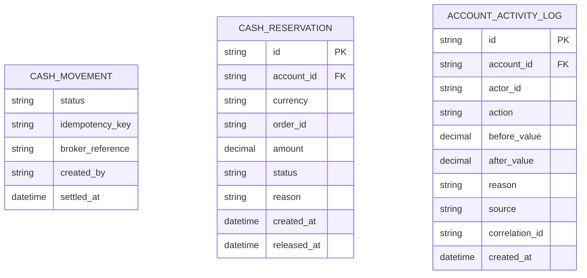

# logiq Database ERD

Tai lieu nay mo ta thiet ke database logical dua tren `docs/FEATURES.md`.
Hien tai app chua co repository/storage layer, nen ERD nay dung lam dinh huong
khi trien khai Hive boxes, SQLite, hoac storage khac sau nay.

Muc tieu thiet ke:

- Xu ly duoc trade thuc te: mot trade co the co nhieu lenh, nhieu lan khop,
  scale in, scale out, phi va thue rieng tung lan khop.
- Mo rong duoc ngoai co phieu neu sau nay can ETF, phai sinh, crypto hoac
  broker/account khac.
- Giu du lieu goc sach de co the tinh lai analytics va dashboard bat cu luc nao.
- Ho tro phan tich theo chien luoc, thi truong, hanh vi, cam xuc, ky luat,
  rui ro, ma giao dich va thoi gian.

## Nhan Dinh Thiet Ke Cu

- `TRADE` dang vua dong vai tro lenh khop, vua dong vai tro vong doi giao
  dich. Cach nay kho xu ly partial fill, mua them, ban mot phan, chot nhieu
  muc gia va tinh lai/lai lo theo tung lan khop.
- `STOCK` qua hep neu sau nay can tai san khac. Nen dung `INSTRUMENT` va de
  `asset_class` phan loai.
- Cac cot boolean trong `TRADE_BEHAVIOR` kho mo rong. Nen dung bang `TAG` va
  `TRADE_TAG` de them hanh vi/sai lam/setup moi ma khong can sua schema.
- Danh muc can phan biet tien nap/rut voi PnL giao dich. Neu khong co
  ledger tien va balance hien tai, dashboard loi nhuan, drawdown va buying
  power se sai hoac kho audit.
- Insight va dashboard nen la du lieu dan xuat/materialized view. Nguon su
  that phai nam o order/fill, plan, review, risk check va portfolio snapshot.

## Nguyen Tac Thiet Ke

- `TRADE_FILL`, `TRADE_PLAN`, `TRADE_REVIEW`, `RISK_CHECK`,
  `PORTFOLIO_SNAPSHOT`, `POSITION_SNAPSHOT` la nguon du lieu chinh.
- Cac truong tong hop trong `TRADE` va cac bang `ANALYTICS_*` duoc phep cache,
  nhung phai tinh lai duoc tu du lieu goc.
- Tien, gia va khoi luong khong nen luu bang floating point. Khi trien khai,
  uu tien decimal string hoac minor unit integer tuy database.
- Moi bang chinh dung `id` kieu UUID/ULID. Cac quan he luu bang id de phu hop
  ca Hive va SQLite.
- Du lieu journal, note, lesson va self review la du lieu rieng tu cua nguoi
  dung. Khong log, telemetry hoac export neu chua co yeu cau ro rang.

```mermaid
erDiagram
    TRADING_ACCOUNT {
        string id PK
        string name
        string broker_name
        string account_type
        string base_currency
        string status
        datetime created_at
        datetime updated_at
        datetime deleted_at
    }

    INSTRUMENT {
        string id PK
        string symbol
        string exchange
        string name
        string asset_class
        string currency
        string sector
        string industry
        datetime created_at
        datetime updated_at
        datetime deleted_at
    }

    STRATEGY {
        string id PK
        string name
        string description
        string status
        datetime created_at
        datetime updated_at
        datetime deleted_at
    }

    STRATEGY_VERSION {
        string id PK
        string strategy_id FK
        int version_number
        string entry_rules
        string exit_rules
        string suitable_market_condition
        string common_mistakes
        date effective_from
        date effective_to
        datetime created_at
    }

    TRADE {
        string id PK
        string account_id FK
        string instrument_id FK
        string strategy_version_id FK
        string direction
        string status
        datetime opened_at
        datetime closed_at
        decimal quantity_opened
        decimal quantity_closed
        decimal avg_entry_price
        decimal avg_exit_price
        decimal total_fee
        decimal total_tax
        decimal gross_pnl
        decimal net_pnl
        decimal pnl_percent
        decimal r_multiple
        datetime created_at
        datetime updated_at
        datetime deleted_at
    }

    TRADE_ORDER {
        string id PK
        string trade_id FK
        string order_side
        string order_type
        string intent
        decimal planned_price
        decimal stop_price
        decimal limit_price
        decimal quantity
        string status
        datetime placed_at
        datetime created_at
        datetime updated_at
    }

    TRADE_FILL {
        string id PK
        string trade_id FK
        string order_id FK
        datetime executed_at
        decimal price
        decimal quantity
        decimal fee
        decimal tax
        decimal gross_value
        decimal net_cash_flow
        string source
        datetime created_at
    }

    TRADE_PLAN {
        string id PK
        string trade_id FK
        string thesis
        decimal entry_zone_low
        decimal entry_zone_high
        decimal stop_loss_price
        decimal planned_risk_amount
        int confidence_percent
        string invalidation_note
        datetime created_at
        datetime updated_at
    }

    TRADE_PLAN_TARGET {
        string id PK
        string trade_plan_id FK
        int target_order
        decimal target_price
        decimal planned_quantity_percent
        string note
    }

    TRADE_REVIEW {
        string id PK
        string trade_id FK
        string exit_reason
        bool followed_plan
        string mistake_summary
        string lesson
        int discipline_score
        string self_review
        datetime created_at
        datetime updated_at
    }

    TRADE_CONTEXT {
        string id PK
        string trade_id FK
        string market_condition
        string trend_direction
        string volatility_level
        string timeframe
        int setup_quality_score
        string note
        datetime created_at
        datetime updated_at
    }

    EMOTION_LOG {
        string id PK
        string trade_id FK
        string journal_id FK
        string moment
        string emotion_type
        int intensity
        string note
        datetime created_at
    }

    TAG {
        string id PK
        string tag_type
        string name
        string description
        string color_key
        bool is_system
        datetime created_at
        datetime updated_at
    }

    TRADE_TAG {
        string id PK
        string trade_id FK
        string tag_id FK
        string note
        datetime created_at
    }

    RISK_RULE {
        string id PK
        string account_id FK
        string name
        decimal risk_percent_per_trade
        decimal max_daily_loss_amount
        decimal max_weekly_loss_amount
        decimal max_monthly_loss_amount
        string stop_trading_rule
        date effective_from
        date effective_to
        bool is_active
        datetime created_at
        datetime updated_at
    }

    RISK_CHECK {
        string id PK
        string trade_id FK
        string risk_rule_id FK
        decimal planned_risk_amount
        decimal actual_risk_amount
        decimal max_allowed_risk_amount
        decimal risk_per_share
        decimal planned_position_size
        bool exceeded_risk
        bool followed_risk_rule
        string violation_reason
        datetime created_at
        datetime updated_at
    }

    PORTFOLIO_SNAPSHOT {
        string id PK
        string account_id FK
        date snapshot_date
        decimal cash_balance
        decimal positions_market_value
        decimal total_equity
        decimal net_deposit_to_date
        decimal daily_pnl
        decimal cumulative_pnl
        decimal drawdown_percent
        string note
        datetime created_at
    }

    POSITION_SNAPSHOT {
        string id PK
        string snapshot_id FK
        string instrument_id FK
        decimal quantity
        decimal average_cost
        decimal market_price
        decimal market_value
        decimal unrealized_pnl
        decimal weight_percent
    }

    ACCOUNT_BALANCE {
        string id PK
        string account_id FK
        string currency
        decimal current_cash_balance
        decimal available_cash
        decimal reserved_cash
        decimal buying_power
        datetime updated_at
    }

    CASH_LEDGER {
        string id PK
        string account_id FK
        string movement_type
        decimal amount
        decimal balance_before
        decimal balance_after
        string reference_type
        string reference_id
        string status
        datetime created_at
    }

    PRICE_QUOTE {
        string id PK
        string instrument_id FK
        datetime quoted_at
        decimal price
        string price_type
        string source
        datetime created_at
    }

    DAILY_JOURNAL {
        string id PK
        string account_id FK
        date journal_date
        string market_view
        string trading_plan
        string watchlist_note
        string completed_actions
        bool followed_plan
        string mistakes
        string wins
        string free_note
        int discipline_score
        datetime created_at
        datetime updated_at
        datetime deleted_at
    }

    INSTRUMENT_NOTE {
        string id PK
        string instrument_id FK
        string thesis
        string strengths
        string weaknesses
        string risks
        string bull_case
        string bear_case
        string status
        datetime created_at
        datetime updated_at
        datetime deleted_at
    }

    INSTRUMENT_NOTE_UPDATE {
        string id PK
        string instrument_note_id FK
        string content
        datetime created_at
    }

    INSIGHT {
        string id PK
        string account_id FK
        string insight_type
        string title
        string description
        string source_metric
        string source_entity_type
        string source_entity_id
        string recommendation
        string status
        date period_start
        date period_end
        datetime generated_at
        datetime dismissed_at
    }

    ANALYTICS_TRADE_FACT {
        string id PK
        string trade_id FK
        string account_id FK
        string instrument_id FK
        string strategy_version_id FK
        date opened_date
        date closed_date
        string direction
        decimal net_pnl
        decimal pnl_percent
        decimal r_multiple
        decimal total_fee
        decimal total_tax
        int holding_period_minutes
        bool followed_plan
        int discipline_score
        bool risk_violation
        string market_condition
        string primary_emotion
        datetime generated_at
    }

    ANALYTICS_DAILY_ACCOUNT_FACT {
        string id PK
        string account_id FK
        date metric_date
        decimal total_equity
        decimal daily_pnl
        decimal cumulative_pnl
        decimal net_deposit
        decimal drawdown_percent
        int trade_count
        int win_count
        int loss_count
        datetime generated_at
    }

    TRADING_ACCOUNT ||--o{ TRADE : owns
    INSTRUMENT ||--o{ TRADE : traded_as
    STRATEGY ||--o{ STRATEGY_VERSION : versions
    STRATEGY_VERSION ||--o{ TRADE : applied_as
    TRADE ||--o{ TRADE_ORDER : groups
    TRADE ||--o{ TRADE_FILL : summarizes
    TRADE_ORDER ||--o{ TRADE_FILL : executes
    TRADE ||--o| TRADE_PLAN : planned_by
    TRADE_PLAN ||--o{ TRADE_PLAN_TARGET : targets
    TRADE ||--o| TRADE_REVIEW : reviewed_by
    TRADE ||--o| TRADE_CONTEXT : described_by
    TRADE ||--o{ EMOTION_LOG : records
    DAILY_JOURNAL ||--o{ EMOTION_LOG : records
    TAG ||--o{ TRADE_TAG : labels
    TRADE ||--o{ TRADE_TAG : classified_by
    TRADING_ACCOUNT ||--o{ RISK_RULE : defines
    RISK_RULE ||--o{ RISK_CHECK : evaluates
    TRADE ||--o| RISK_CHECK : checked_by
    TRADING_ACCOUNT ||--o{ PORTFOLIO_SNAPSHOT : snapshots
    PORTFOLIO_SNAPSHOT ||--o{ POSITION_SNAPSHOT : contains
    INSTRUMENT ||--o{ POSITION_SNAPSHOT : valued_as
    TRADING_ACCOUNT ||--o{ ACCOUNT_BALANCE : maintains
    TRADING_ACCOUNT ||--o{ CASH_LEDGER : records
    INSTRUMENT ||--o{ PRICE_QUOTE : quoted_as
    TRADING_ACCOUNT ||--o{ DAILY_JOURNAL : journals
    INSTRUMENT ||--o{ INSTRUMENT_NOTE : documents
    INSTRUMENT_NOTE ||--o{ INSTRUMENT_NOTE_UPDATE : tracks
    TRADING_ACCOUNT ||--o{ INSIGHT : receives
    TRADE ||--o| ANALYTICS_TRADE_FACT : materializes
    TRADING_ACCOUNT ||--o{ ANALYTICS_DAILY_ACCOUNT_FACT : summarizes
```

## Data Grain

| Bang | Grain | Ghi chu |
| --- | --- | --- |
| `TRADING_ACCOUNT` | Mot tai khoan/danh muc giao dich | Cho phep nhieu broker hoac nhieu tai khoan sau nay. |
| `INSTRUMENT` | Mot ma giao dich tren mot san | Thay cho `STOCK` de mo rong asset class. |
| `TRADE` | Mot y tuong/vong doi giao dich | Co the gom nhieu order va fill. |
| `TRADE_ORDER` | Mot lenh dat | Luu y dinh vao/ra/add/reduce. |
| `TRADE_FILL` | Mot lan khop lenh | Nguon goc de tinh gia von, phi, thue va PnL. |
| `TRADE_PLAN` | Mot ke hoach cho mot trade | Dung truoc khi vao lenh. |
| `TRADE_REVIEW` | Mot review sau trade | Dung cho ky luat, bai hoc va insight. |
| `EMOTION_LOG` | Mot cam xuc tai mot thoi diem | Co the gan vao trade hoac daily journal. |
| `TAG` / `TRADE_TAG` | Mot nhan phan loai | Ho tro setup, sai lam, hanh vi, thi truong, custom tag. |
| `PORTFOLIO_SNAPSHOT` | Mot snapshot tai khoan theo ngay | Nguon cho equity curve va drawdown. |
| `POSITION_SNAPSHOT` | Mot vi the trong snapshot | Nguon cho ty trong va unrealized PnL. |
| `ACCOUNT_BALANCE` | So du tien hien tai theo account/currency | Luu current cash, available cash, reserved cash va buying power. |
| `CASH_LEDGER` | Mot but toan tien theo thu tu thoi gian | Audit duoc balance_before/after, lien ket tham chieu va trang thai pending/completed. |
| `ANALYTICS_*` | Cache phuc vu dashboard | Co the xoa va tinh lai tu bang nguon. |

## Mapping Theo Feature

| Feature | Bang chinh |
| --- | --- |
| Nhat ky giao dich | `TRADE`, `TRADE_ORDER`, `TRADE_FILL`, `TRADE_PLAN`, `TRADE_REVIEW` |
| Theo doi danh muc | `TRADING_ACCOUNT`, `ACCOUNT_BALANCE`, `CASH_LEDGER`, `PORTFOLIO_SNAPSHOT`, `POSITION_SNAPSHOT`, `PRICE_QUOTE` |
| Nhat ky hang ngay | `DAILY_JOURNAL`, `EMOTION_LOG` |
| Tam ly giao dich | `EMOTION_LOG`, `TAG`, `TRADE_TAG`, `TRADE_REVIEW` |
| Phan tich va thong ke | `ANALYTICS_TRADE_FACT`, `ANALYTICS_DAILY_ACCOUNT_FACT`, hoac query truc tiep tu bang nguon |
| Insight va tu danh gia | `INSIGHT`, `TRADE_REVIEW`, `TAG`, `RISK_CHECK`, `ANALYTICS_*` |
| Ghi chu phan tich ma giao dich | `INSTRUMENT_NOTE`, `INSTRUMENT_NOTE_UPDATE`, lien ket voi `TRADE` qua `INSTRUMENT` |
| Quan ly chien luoc | `STRATEGY`, `STRATEGY_VERSION`, `TRADE` |
| Quan ly rui ro va ke hoach | `RISK_RULE`, `RISK_CHECK`, `TRADE_PLAN`, `TRADE_PLAN_TARGET` |

## Chi So Dashboard Ho Tro

Thiet ke tren cho phep tinh cac dashboard sau ma khong can doi schema:

- PnL theo ngay/thang/nam, equity curve, drawdown va cumulative return.
- Win rate, average win, average loss, payoff ratio, expectancy va R-multiple.
- Hieu qua theo strategy version, instrument, asset class, market condition,
  timeframe, setup tag va behavior tag.
- So sanh trade co plan/khong co plan, co follow plan/khong follow plan, co
  risk violation/khong risk violation.
- Moi lien he giua discipline score, emotion intensity, behavior tag va net PnL.
- Ty trong danh muc, unrealized PnL, cash balance, net deposit va daily PnL.

## Index Va Rang Buoc De Xuat

Neu dung SQLite sau nay, nen co cac rang buoc/index sau:

- Unique: `INSTRUMENT(symbol, exchange)`, `STRATEGY_VERSION(strategy_id,
  version_number)`, `PORTFOLIO_SNAPSHOT(account_id, snapshot_date)`,
  `DAILY_JOURNAL(account_id, journal_date)`.
- Index: `TRADE(account_id, opened_at)`, `TRADE(account_id, closed_at)`,
  `TRADE(instrument_id)`, `TRADE(strategy_version_id)`,
  `TRADE_FILL(trade_id, executed_at)`, `TRADE_TAG(tag_id)`,
  `EMOTION_LOG(trade_id, created_at)`,
  `POSITION_SNAPSHOT(snapshot_id, instrument_id)`,
  `ANALYTICS_TRADE_FACT(account_id, closed_date)`.
- Check constraint: diem phan tram/score nam trong khoang hop le, vi du
  `confidence_percent` va `discipline_score` tu 0 den 100 neu UI dung thang
  diem 100.

Neu dung Hive truoc, van giu cung logical model:

- Moi bang co the la mot box rieng hoac gom theo feature khi du lieu con nho.
- Quan he luu bang id, khong luu object long nhau qua sau de tranh migration kho.
- `ANALYTICS_*` nen la cache co the rebuild, khong phai nguon su that.
- `CASH_MOVEMENT` co the giu tam thoi de compatibility migration, nhung nguon
  su that cho dong tien nen chuyen sang `CASH_LEDGER`.

## Ghi Chu Trien Khai

- Giai doan dau co the implement toi thieu: `TRADING_ACCOUNT`, `INSTRUMENT`,
  `TRADE`, `TRADE_ORDER`, `TRADE_FILL`, `TRADE_PLAN`, `TRADE_REVIEW`,
  `DAILY_JOURNAL`. Cac bang analytics va insight co the them khi bat dau lam
  dashboard.
- `TRADE.gross_pnl`, `TRADE.net_pnl`, `TRADE.pnl_percent`, `TRADE.r_multiple`
  la snapshot tong hop de hien thi nhanh. Khi fill thay doi, cac gia tri nay
  phai duoc tinh lai.
- `STRATEGY_VERSION` giu nguyen bo rule tai thoi diem trade. Khi sua strategy,
  tao version moi thay vi sua version cu neu thay doi anh huong lich su phan
  tich.
- `RISK_RULE` co `effective_from` va `effective_to` de trade cu van duoc danh
  gia theo rule dang ap dung luc do.
- `ACCOUNT_BALANCE.available_cash` va `reserved_cash` la dau vao bat buoc de
  check buying power truoc khi dat lenh.
- `CASH_LEDGER` phai luu `status` (`pending`, `completed`, `rejected`) de
  khong cong tien sai khi dong tien chua settle.
- `TAG` nen co tag he thong ban dau cho mistake, behavior va setup pho bien;
  nguoi dung co the them tag custom sau.
- Notes, lessons va journal la du lieu rieng tu. Khi co export/sync/backup,
  can co thiet ke bao mat rieng truoc khi trien khai.

## ERD-Code Mapping Audit Checklist (2026-05-06)

Pham vi doi chieu:

- ERD trong tai lieu nay.
- Model map trong `lib/core/database/models/*_model.dart`.
- Luong su dung thuc te trong `lib/repositories/` va `lib/features/`.

### 1) Kiem tra map field ERD <-> model

- [x] Tat ca field trong ERD da co map trong code model (`missing = 0`).
- [x] Da loai bo 2 field khong thuoc ERD khoi code:
  - `TRADE.plan_note`
  - `TRADE.review_note`

### 2) Kiem tra map quan he (relationship) theo ERD

- [x] Cac quan he cot loi da co du FK field trong model (account_id, instrument_id, strategy_version_id, ...).
- [x] Hoan thien luong CRUD cho `TRADE_ORDER` (da co repository/contract su dung).
- [x] Hoan thien luong CRUD cho `TRADE_PLAN_TARGET` (da co repository/contract su dung).
- [x] Bo sung write path ro rang cho `TRADE_PLAN` (da co `upsert/get latest` trong trade repository).
- [x] Bo sung write path ro rang cho `TRADE_REVIEW` (da co `upsert/get latest` trong trade repository).
- [x] Bo sung write path ro rang cho `TRADE_CONTEXT` (da co `upsert/get latest` trong trade repository).
- [x] Them validate lien ket `TRADE_FILL.order_id -> TRADE_ORDER.id` khi co order flow.

### 3) Checklist field ERD co map nhung chua duoc dung trong luong nghiep vu chinh

- [ ] `TRADE_ORDER.*` (da co contract/repository, nhung chua co luong nghiep vu UI chinh).
- [ ] `TRADE_PLAN_TARGET.*` (da co contract/repository, nhung chua co luong nghiep vu UI chinh).
- [x] `RISK_RULE.max_weekly_loss_amount`
- [x] `RISK_RULE.max_monthly_loss_amount`
- [x] `RISK_RULE.stop_trading_rule`
- [x] `TRADE_FILL.order_id`
- [x] `TRADE_FILL.gross_value`
- [x] `TRADE_CONTEXT.trend_direction`
- [x] `TRADE_CONTEXT.volatility_level`
- [x] `TRADE_CONTEXT.timeframe`
- [x] `TRADE_CONTEXT.setup_quality_score`
- [x] `TRADE_REVIEW.exit_reason`
- [x] `TRADE_REVIEW.mistake_summary`
- [x] `TRADE_REVIEW.lesson`
- [x] `TRADE_REVIEW.self_review`
- [x] `TRADE_PLAN.entry_zone_low`
- [x] `TRADE_PLAN.entry_zone_high`
- [x] `TRADE_PLAN.stop_loss_price`
- [x] `TRADE_PLAN.confidence_percent`
- [x] `TRADE_PLAN.invalidation_note`

Ghi chu:

- Danh sach tren la "chua dung trong luong nghiep vu chinh" (UI/VM/Repository runtime),
  khong phai "thieu trong model map".
- Cac muc da tick [x] trong dot nay da co write/read path o repository runtime;
  UI nghiep vu chi tiet cho chung co the tiep tuc bo sung sau.
- Cac field analytics co the duoc phep chua hien thi tren UI ngay, mien la build/rebuild
  analytics van hoat dong tu du lieu goc.

## Cash Management Extension (2026-05-06)

The local Hive schema has been extended in a backward-compatible way for cash
management hardening:

Rules:

- Only `CASH_MOVEMENT.status = completed` affects `ACCOUNT_BALANCE`.
- Pending movements, reservations, releases and fills must create audit records.
- Reservation records are keyed by order id in local storage to keep order
  reserve/release idempotent for the current app architecture.
